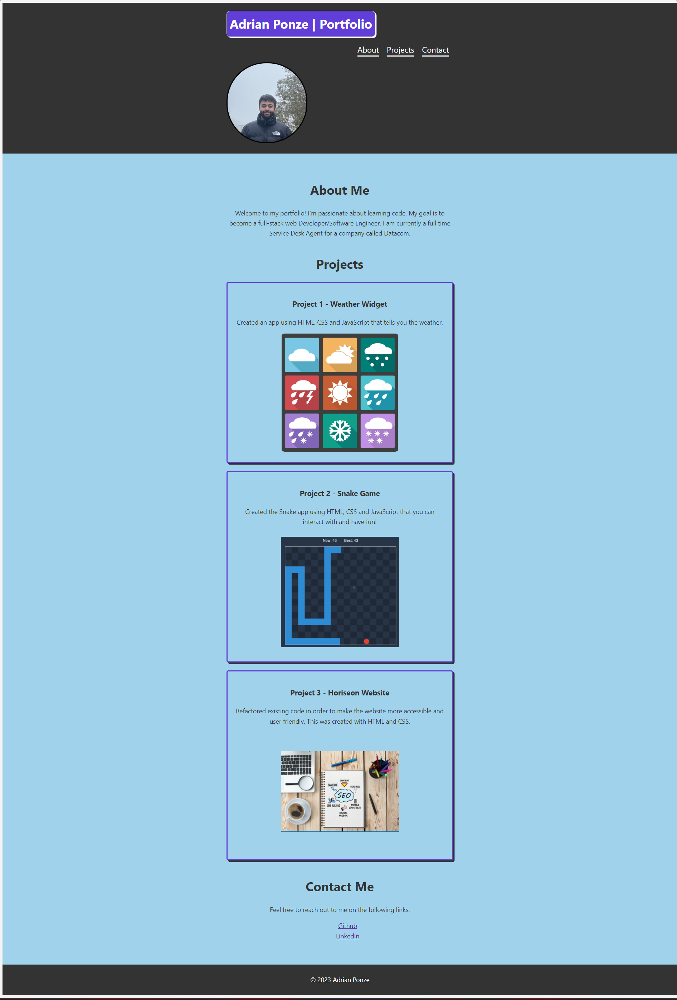

# Challenge 02 - Professional Portfolio

## Description

In this task, I had to build a professional portfolio about myself and about my applications that I have made thus far. Although two of them are just placeholders (for now), I will be adding applications that are made by me in the future as this course progresses.

## Usage

You can view the page through this link https://y1va.github.io/02-My-Portfolio/

In order to see this website's true colours, shrink it down and watch the colours change. It is also highly responsive for mobile phones.

## Preview

## Credits

N/A

## License

This project is licensed under the [MIT License](./LICENSE).
